# Feedforward neural networks - Hands-On Neural Networks

*   [Playlists Playlists](https://subscription.packtpub.com/#)

Bookmark [Code Files](https://account.packtpub.com/getfile/9781788992596/code)

## Feedforward neural networks

One of the main drawbacks of the perceptron algorithm is that it's only able to capture linear relationships. An example of a simple task that it's not able to solve is the logic XOR.  The logic XOR is a very simple function in which the output is true only when its two pieces of binary input are different from each other. It can be described with the following table:

<table style="border-collapse: collapse;border-top: 0.5pt solid ; border-bottom: 0.5pt solid ; " width=""><colgroup><col><col><col></colgroup><tbody><tr><td style="border-right: 0.5pt solid ; border-bottom: 0.5pt solid ; "><p></p></td><td style="border-right: 0.5pt solid ; border-bottom: 0.5pt solid ; "><p><code class="literal">X2 = 0</code></p></td><td style="border-bottom: 0.5pt solid ; "><p><code class="literal">X2 = 1</code></p></td></tr><tr><td style="border-right: 0.5pt solid ; border-bottom: 0.5pt solid ; "><p><code class="literal">X1 = 0</code></p></td><td style="border-right: 0.5pt solid ; border-bottom: 0.5pt solid ; "><p><code class="literal">False</code></p></td><td style="border-bottom: 0.5pt solid ; "><p><code class="literal">True</code></p></td></tr><tr><td style="border-right: 0.5pt solid ; "><p><code class="literal">X1 = 1</code></p></td><td style="border-right: 0.5pt solid ; "><p><code class="literal">True</code></p></td><td style=""><p><code class="literal">False</code></p></td></tr></tbody></table>

The preceding table can be also represented with the following plot:

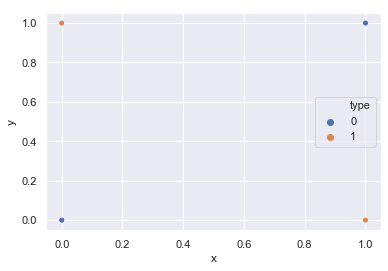

The XOR problem visualized

In the XOR problem, it's not possible to find a line that correctly divides the prediction space in two.

It's not possible to separate this problem using a linear function, so our previous perceptron would not help here. Now, the decision boundary in the previous example was a single line, so it's easy to note that in this case, two lines would be sufficient to classify our input.

But now, we have a problem: if we feed the output of our previous perceptron to another one, we will still only have a linear combination of the input, so in this way, we will not be able to add any non-linearity.

You can easily see that if you add more and more, you will be able to separate the space in a more complex way. That's what we want to achieve with **Multilayer Neural Networks**:

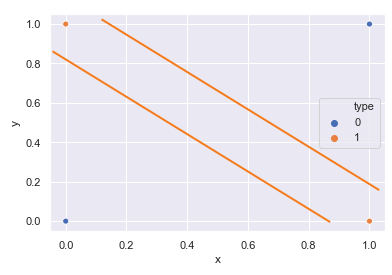

It's possible to correctly separate the space with two distinct linear functions

Another way to introduce non-linearity is by changing the activation function. As we mentioned before, the step function is just one of our options; there are also non-linear ones, such as **Rectified Linear Unit** (**ReLU**) and the `sigmoid`. In this way, it's possible to compute continuous output and combine more neurons into something that divides the solution space.

This intuitive concept is mathematically formulated in the universal approximation theorem, which states that an arbitrary continuous function can be approximated using a multilayer perceptron with only one hidden layer. A hidden layer is a layer of neurons in between the input and output. This result is true for a variety of activation functions, for example, RELU and `sigmoid`.

A Multilayer Neural Network is a particular case of a **feedforward neural network** (**FFNN**), which is a network that has only one direction, from the input to the output.

One of the main differences is how you train an FFNN; the most common way is through backpropagation.

### Introducing backpropagation

Before going into the math, it will be useful to develop an intuitive sense of what the training does. If we look back at our perceptron class, we simply measure the error by using the difference between the real output and our prediction. If we wanted to predict a continuous output rather than just a binary one, we would have to use a different way to measure the error, as positive and negative errors might cancel each other out.

A common way to avoid this kind of problem is by measuring the error by using the **root mean square error** (**RMSE**), which is defined as follows:

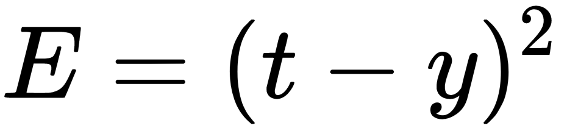

If we plot the square error and we let our prediction vary, we will obtain a parabolic curve:

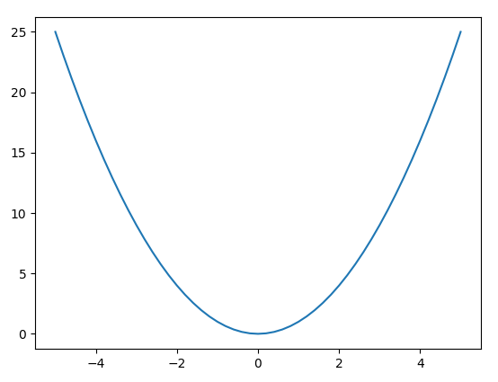

The error surface for a single neuron

In reality, our prediction is controlled by the weights and the bias, which is what we are changing to decrease the error. By varying the weights and the bias, we obtain a more complex curve; its complexity will depend on the number of weights and biases we have. For a generic neuron with _n_ weights, we will have an elliptic paraboloid of an _n+1_ dimension, as we need to vary the bias, as well:

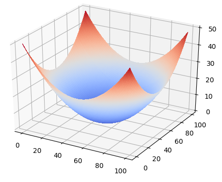

Error surface for a linear perceptron

The lowest point of the curve is known as the global minima, and it's where we have the lowest possible loss, which means that we can't have less of an error than that. In this simple case, the global minima is also the only minima we have, but in complex functions, we can also have a few local minima. A local minima is defined as the lowest point in an arbitrary small interval around, so it's not necessarily the lowest overall.

In this way, we can see the training process as an optimization problem that is looking for the lowest point of the curve in an efficient way. A convenient way to explore the error surface is by using gradient descent. The gradient descent method uses the derivative of the squared error function with respect to the weights of the network, and it follows the downward direction. The direction is given by the gradient. As we will look at the derivative of the function, for convenience, we will consider a slightly different way of measuring the square error, compared to what we saw before:

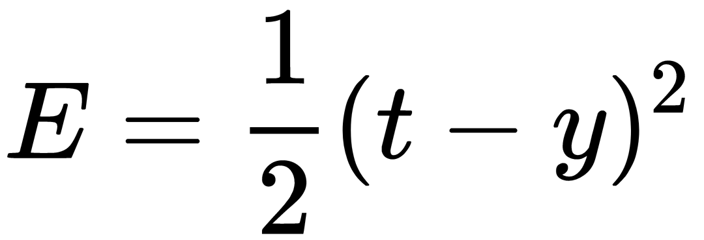

We decided to divide the square error by two, just to cancel out the coefficient that the derivation will add. This will not affect our error surface, even more so because later on, we will multiply the error function by another coefficient called the **learning rate**.

The training of the network is normally done using backpropagation, which is used to calculate the steepest descent direction. If we look at each neuron individually, we can see the same formula that we saw for the perceptron; the only difference is that now, the input of one neuron is the output of an another one. Let's take the neuron _j_; it will run through its activation function and the result of all of the networks before it:

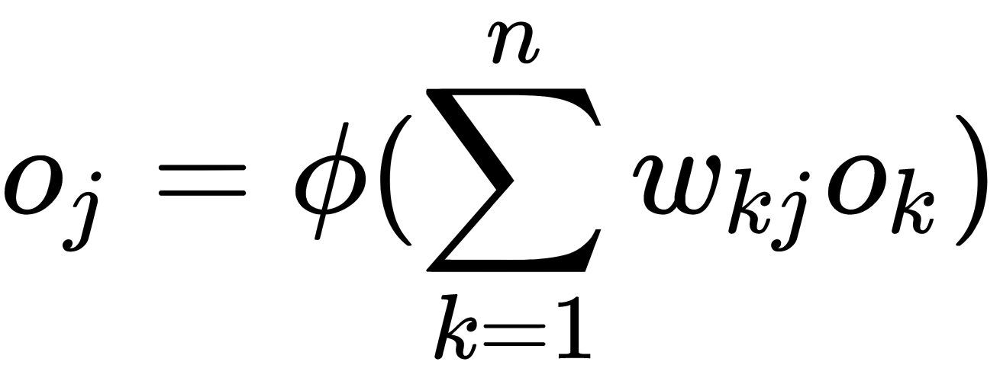

If the neuron is in the first layer after the input layer, then the input layers are simply the input to the network. With _n_, we denote the number of input units of the neuron _j_. With

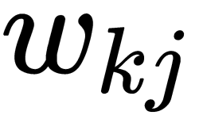

, we denote the weight between the output of the neuron _k_ and our neuron _j_.

The activation function, which we want to be non-linear and differentiable, is denoted by the Greek letter

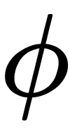

. We want it to be non-linear because otherwise, the combination of a series of linear neurons will still be linear, and we want it to be differentiable, because we want to calculate the gradient.

A very common activation function is the logistic function, also known as the `sigmoid` function, defined by the following formula:

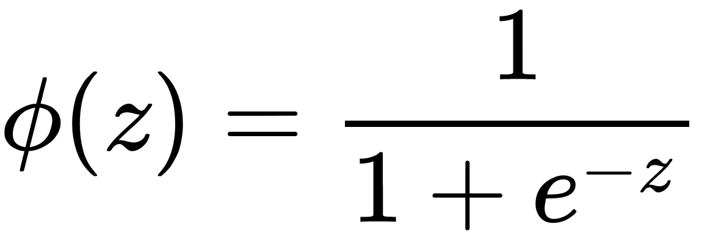

This has a convenient derivative of the following formula:

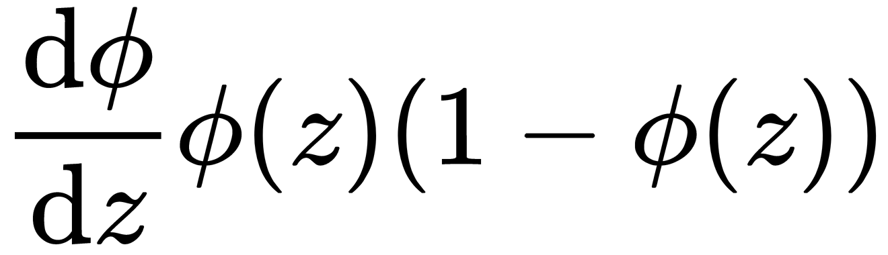

The peculiar part of backpropagation is that not only does the inputs go to the output to adjust the weights, but the output also goes back to the input:

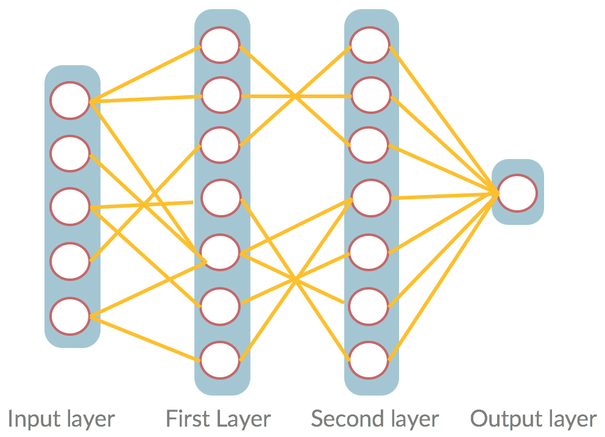

A simple FFNN for binary classification

### Activation functions

So far, you have seen two different activation functions: a step function and a `sigmoid`. But there are many others that, depending on the task, can be more or less useful.

Activation functions are usually used to introduce non-linearity. Without it, we will only have a linear combination of input going through another linear function.

We will now look at a few activation functions and their code in Keras, in detail.

#### Sigmoid

As you have already seen, the `sigmoid` function is a particular case of the logistic function, and it gives us something similar to a step function; therefore, it's useful for binary classifications, indicating a probability as a result. The function is differentiable; therefore, we can run gradient descent for every point. It's also monotonic, which means that it always increases or decreases, but its derivative does not; therefore, it will have a minima.It forces all output values to be between 0 and 1. Because of this, even very high values asymptotically tend to one and very low to 0. One problem that this creates is that the derivative in those points is approximately 0; therefore, the gradient descent process will not find a local minima for very high or very low values, as shown in the following diagram:

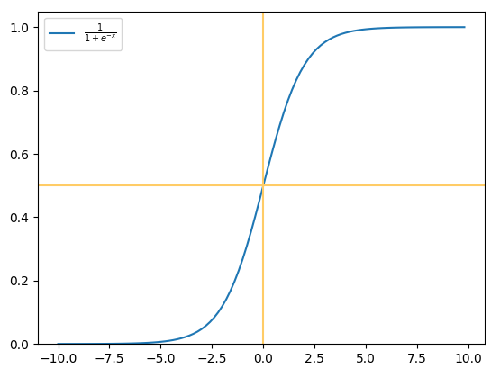

##### Softmax

The softmax function is a generalization of the `sigmoid` function. While the `sigmoid` gives us the probability for a binary output, softmax allows us to transform an un-normalized vector into a probability distribution. That means that the softmax will output a vector that will sum up to 1, and all of its values will be between 0 and 1. 

##### Tanh

As we said, the logistic sigmoid can cause a neural network to get stuck, as a high or low value input will produce a result very near zero. This will mean that the gradient descent will not update the weights and not train the model.

The hyperbolic tangent, or the `tanh` function, is an alternative to `sigmoid`, and it still has a sigmoidal shape. The difference is that it will output a value between -1 and 1. Hence, strongly negative input to the `tanh` function will map to negative output. Additionally, only zero-valued input is mapped to near-zero output. These properties make the network less likely to get stuck during training:

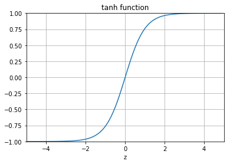

Hyperbolic tangent function

### ReLU

ReLU is one of the most commonly used activation functions. It behaves like a linear function when the input is greater than 0; otherwise, it will always be equal to 0. It's the analog of the half-wave rectification in electrical engineering, 

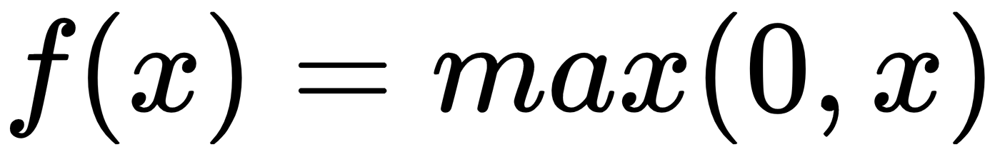

:

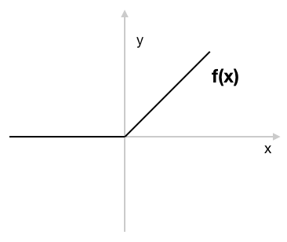

The ReLU function

The range for this function is from 0 to infinite. The issue is that the negative values become zero; therefore, the derivative will always be constant. This is clearly an issue for backpropagation, but in practical cases, it does not have an effect. 

There are a few variants of ReLU; one of the most common ones is Leaky ReLU, which aims to allow a positive small gradient when the function is not active. Its formula is as follows:

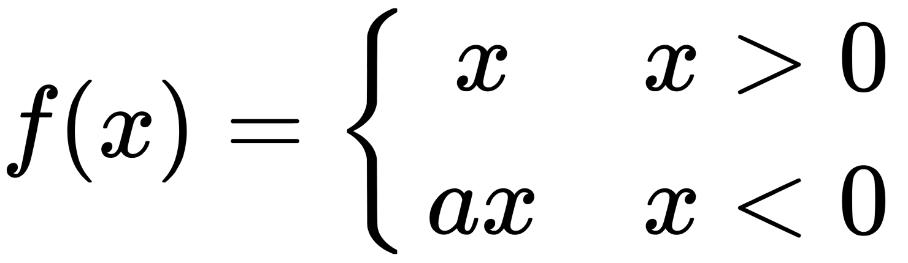

Here, 

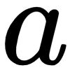

is typically 0.01, as shown in the following diagram:

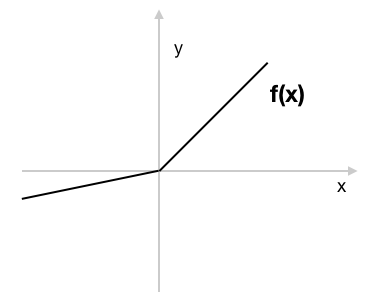

The Leaky ReLU function

### Keras implementation

In Keras, it's possible to specify the activations through either an **activation layer** or through the activation argument supported by all forward layers:

Copy

```markup
from keras.layers import Activation, Dense
model.add(Dense(32))
model.add(Activation('tanh'))
```

This is equivalent to the following command:

Copy

```markup
model.add(Dense(32, activation='tanh'))
```

You can also pass an element-wise TensorFlow/Theano/CNTK function as an activation:

Copy

```markup
from keras import backend as K
model.add(Dense(32, activation=K.tanh))
```

#### The chain rule

One of the fundamental principles to compute backpropagation is the chain rule, which is a more generic form of the delta rule that we saw for the perceptron.

The chain rule uses the property of derivatives to calculate the result of the composition of more functions. By putting neurons in series, we are effectively creating a composition of functions; therefore, we can apply the chain rule formula:

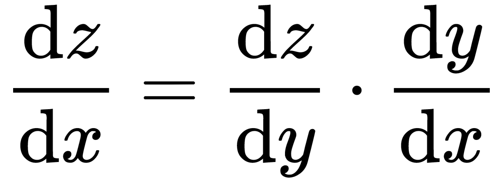

In this particular case, we want to find the weight that minimizes our error function. To do that, we derive our error function in respect to the weights, and we follow the direction of the descending gradient. So, if we consider the neuron _j_, we will see that its input comes from the previous part of the network, which we can denote with _networkj_. The output of the neuron will be denoted with _oj_; therefore, applying the chain rule, we will obtain the following formula:

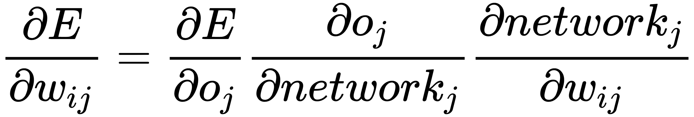

Let's focus on every single element of this equation. The first factor is exactly what we had before with the perceptron; therefore, we get the following formula:

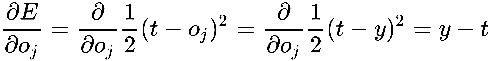

This is because in this case, _oj_ is also the output of the neurons in the next layer that we can denote with _L_. If we denote the number of neurons in a given layer with l, we will have the following formula:


That's where the delta rule that we used previously comes from.

When it's not the output neuron that we are deriving, the formula is more complex, as we need to consider each single neuron as it might be connected with a different part of the network. In that case, we have the following formula:

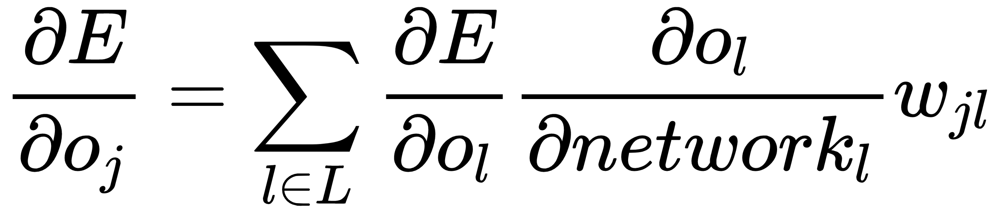

Then, we need to derive the output representation we found in respect to the rest of the network. In this case, the activation function is a `sigmoid`; therefore, the derivative is pretty easy to calculate:

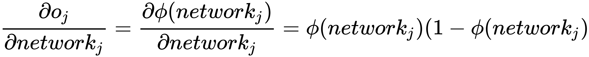

The derivative of the input of neuron _oj_ (_networkj_) with respect to the weight that connects the neuron with our neuron _j_ is simply the partial derivative of the activation function. In the last element, only one term depends on _wij_; therefore, everything else becomes _0_:

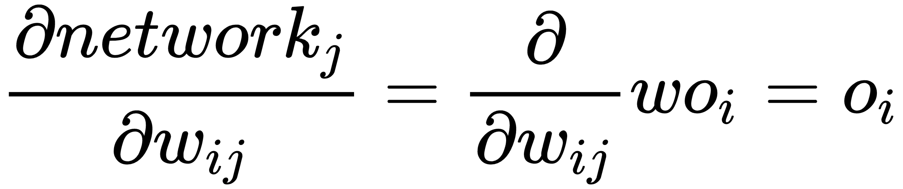

Now, we can see the general case of the delta rule:

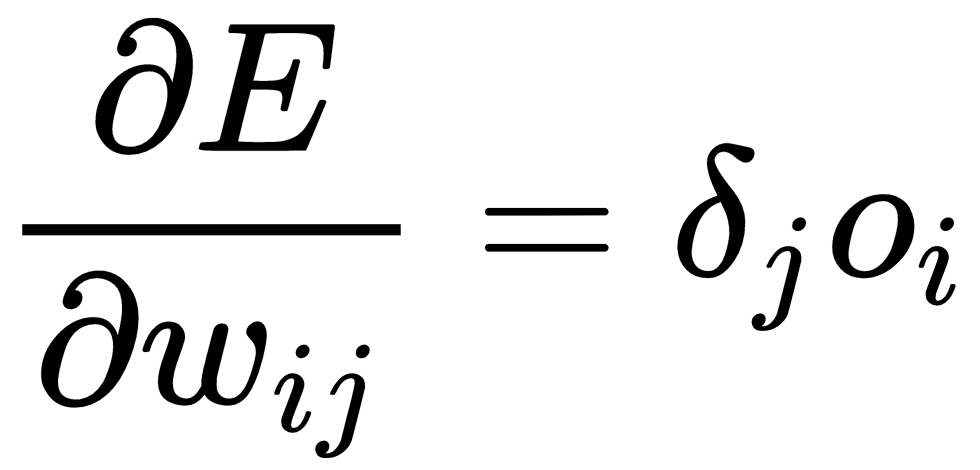

Here, we denote the following formula:

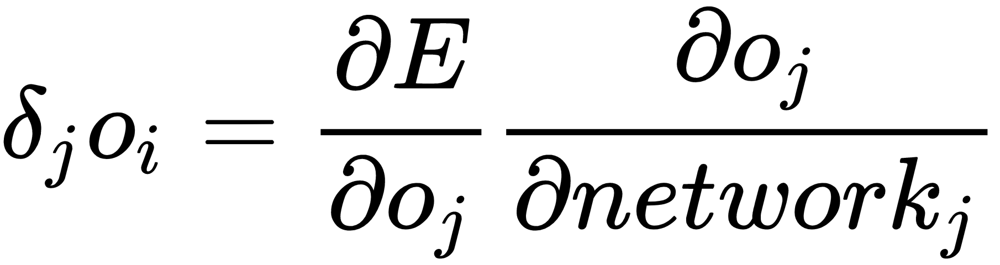

Now, the gradient descent technique wants to move our weights one step toward the direction of the gradient. This one step is something it's up to us to define, depending on how fast we want the algorithm to converge and how close we want to go to the local minima. If we take too large of a step, it's unlikely that we will find the minima, and if we take too small of a step, it will take too much time to find it:

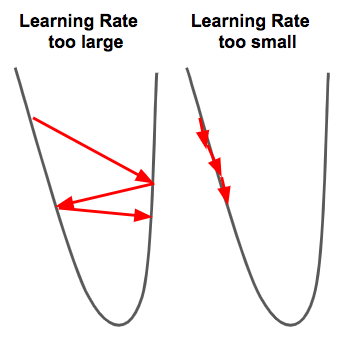

We mentioned that with gradient descent, we are not guaranteed to find a local minima, and this is because of the non-convexity of error functions in neural networks. How well we explore the error space will depend on parameters such as the step size and the learning rate, but also on how well we created the dataset.

Unfortunately, at the moment, there is no formula that guarantees a good way to explore the error function. It's a process that still requires a bit of craftsmanship, and because of that, some theoretical purists look at deep learning as an inferior technique, preferring the more complete statistical formulations. But if we choose to look at the other side of the matter, this can be seen as a great opportunity for researchers to advance the field. The growth of deep learning in practical applications is what has driven the success of the field, demonstrating that the current limitations are not major drawbacks.

#### The XOR problem

Let's try to solve the XOR problem we presented earlier with a simple FFNN, by performing the following steps:

1.  First of all, let's import everything we will need for this task and seed our random function:

Copy

```markup
import numpy as np
import pandas as pd
from sklearn.metrics import confusion_matrix
from sklearn.metrics import roc_auc_score
from sklearn.metrics import mean_squared_error
import matplotlib

matplotlib.use("TkAgg")

# initiating random number
np.random.seed(11)
```

2.  To make it more similar to a real-word problem, we will add some noise to the XOR input, and we will try to predict a binary task:

Copy

```markup
#### Creating the dataset

# mean and standard deviation for the x belonging to the first class
mu_x1, sigma_x1 = 0, 0.1

# Constant to make the second distribution different from the first
# x1_mu_diff, x2_mu_diff, x3_mu_diff, x4_mu_diff = 0.5, 0.5, 0.5, 0.5
x1_mu_diff, x2_mu_diff, x3_mu_diff, x4_mu_diff = 0, 1, 0, 1

# creating the first distribution
d1 = pd.DataFrame({'x1': np.random.normal(mu_x1, sigma_x1, 
                  1000) + 0,
'x2': np.random.normal(mu_x1, sigma_x1,
1000) + 0,'type': 0})

d2 = pd.DataFrame({'x1': np.random.normal(mu_x1, sigma_x1, 
                  1000) + 1,
                  'x2': np.random.normal(mu_x1, sigma_x1,
1000) - 0,'type': 1})

d3 = pd.DataFrame({'x1': np.random.normal(mu_x1, sigma_x1, 
                  1000) - 0,
'x2': np.random.normal(mu_x1, sigma_x1, 
                  1000) - 1,'type': 0})

d4 = pd.DataFrame({'x1': np.random.normal(mu_x1, sigma_x1, 
                  1000) - 1,
'x2': np.random.normal(mu_x1, sigma_x1, 
                  1000) + 1, 'type': 1})

data = pd.concat([d1, d2, d3, d4], ignore_index=True)
```

In this way, we will get a noisy XOR, as shown in the following screenshot:

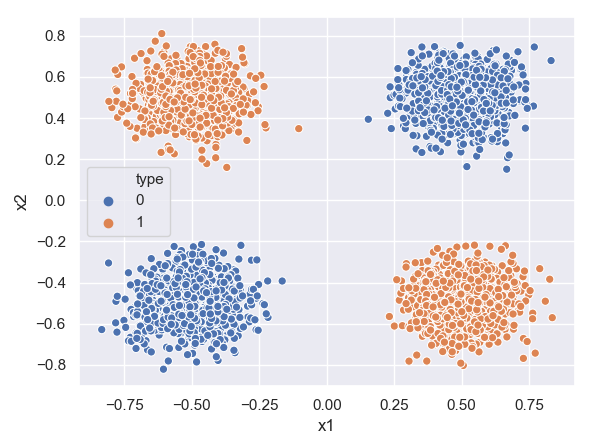

* * *

[Previous Section](https://subscription.packtpub.com/book/big_data_and_business_intelligence/9781788992596/2/ch02lvl1sec18/keras) [Next Section](https://subscription.packtpub.com/book/big_data_and_business_intelligence/9781788992596/2/ch02lvl1sec20/ffnn-in-python-from-scratch)

* * *

---------------------------------------------------


Original url: [Access](https://subscription.packtpub.com/book/big_data_and_business_intelligence/9781788992596/2/ch02lvl1sec19/feedforward-neural-networks)

Created at: 2019-10-28 12:04:28

Category: ML

Tags: `subscription.packtpub.com`

